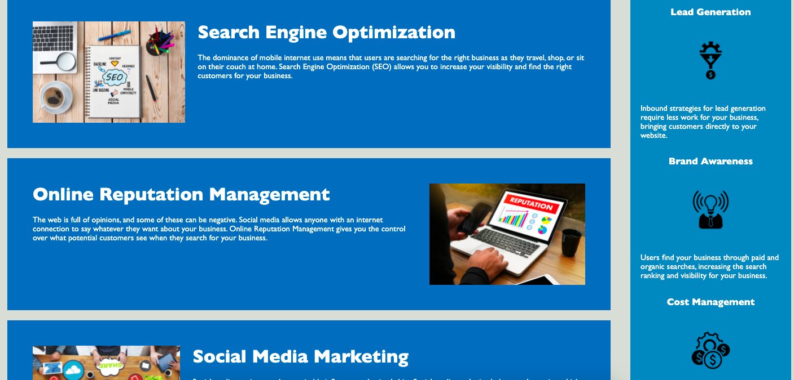

# homework_week_1

The motivation behind this application was to refactor the code in order to include semantic HTML as well as making it accessible and more visible for search enginge optimization. 

## Description

1. The html file has been refactored to include semantic HTML as well as accessibility options.

2. I included a header, nav, main, sections, aside, footer and h1-h4. I've also included alt image text.

3. The CSS file has been refactored to include the semantic html elements as well as to be more concise and in order of how the elements appear on the page. I have included notes on the CSS file to explain what the styling is doing to the page in places where it is unclear as well as to be able to find the elements in the file. 

## Usage

The application is a landing page for Horiseon. 

Information on the page includes search enginge optimization, online reputation management, and social media marketing. It also includes lead generation, brand awareness, and cost management. 

The application can be found here: https://emmareimer.github.io/homework_week_1/

The following images show the web application's appearance and functionality:

